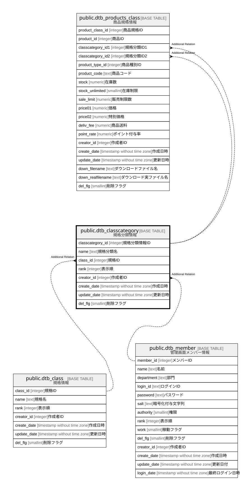

# public.dtb_classcategory

## Description

規格分類情報

## Columns

| Name | Type | Default | Nullable | Children | Parents | Comment |
| ---- | ---- | ------- | -------- | -------- | ------- | ------- |
| classcategory_id | integer |  | false | [public.dtb_products_class](public.dtb_products_class.md) |  | 規格分類情報ID |
| name | text |  | true |  |  | 規格分類名 |
| class_id | integer |  | false |  | [public.dtb_class](public.dtb_class.md) | 規格ID |
| rank | integer |  | true |  |  | 表示順 |
| creator_id | integer |  | false |  | [public.dtb_member](public.dtb_member.md) | 作成者ID |
| create_date | timestamp without time zone | CURRENT_TIMESTAMP | false |  |  | 作成日時 |
| update_date | timestamp without time zone |  | false |  |  | 更新日時 |
| del_flg | smallint | 0 | false |  |  | 削除フラグ |

## Constraints

| Name | Type | Definition |
| ---- | ---- | ---------- |
| dtb_classcategory_class_id_not_null | n | NOT NULL class_id |
| dtb_classcategory_classcategory_id_not_null | n | NOT NULL classcategory_id |
| dtb_classcategory_create_date_not_null | n | NOT NULL create_date |
| dtb_classcategory_creator_id_not_null | n | NOT NULL creator_id |
| dtb_classcategory_del_flg_not_null | n | NOT NULL del_flg |
| dtb_classcategory_update_date_not_null | n | NOT NULL update_date |
| dtb_classcategory_pkey | PRIMARY KEY | PRIMARY KEY (classcategory_id) |

## Indexes

| Name | Definition |
| ---- | ---------- |
| dtb_classcategory_pkey | CREATE UNIQUE INDEX dtb_classcategory_pkey ON public.dtb_classcategory USING btree (classcategory_id) |

## Relations

---

> Generated by [tbls](https://github.com/k1LoW/tbls)
