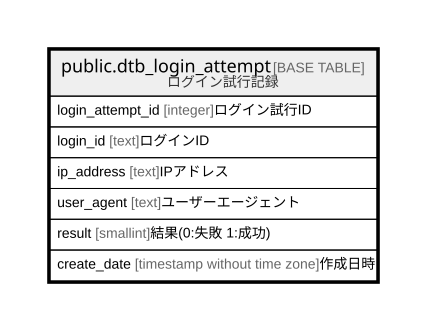

# public.dtb_login_attempt

## Description

ログイン試行記録

## Columns

| Name | Type | Default | Nullable | Children | Parents | Comment |
| ---- | ---- | ------- | -------- | -------- | ------- | ------- |
| login_attempt_id | integer | nextval('dtb_login_attempt_login_attempt_id_seq'::regclass) | false |  |  | ログイン試行ID |
| login_id | text |  | false |  |  | ログインID |
| ip_address | text |  | true |  |  | IPアドレス |
| user_agent | text |  | true |  |  | ユーザーエージェント |
| result | smallint |  | false |  |  | 結果(0:失敗 1:成功) |
| create_date | timestamp without time zone | CURRENT_TIMESTAMP | false |  |  | 作成日時 |

## Constraints

| Name | Type | Definition |
| ---- | ---- | ---------- |
| dtb_login_attempt_create_date_not_null | n | NOT NULL create_date |
| dtb_login_attempt_login_attempt_id_not_null | n | NOT NULL login_attempt_id |
| dtb_login_attempt_login_id_not_null | n | NOT NULL login_id |
| dtb_login_attempt_result_not_null | n | NOT NULL result |
| dtb_login_attempt_pkey | PRIMARY KEY | PRIMARY KEY (login_attempt_id) |

## Indexes

| Name | Definition |
| ---- | ---------- |
| dtb_login_attempt_pkey | CREATE UNIQUE INDEX dtb_login_attempt_pkey ON public.dtb_login_attempt USING btree (login_attempt_id) |
| idx_login_id_create_date | CREATE INDEX idx_login_id_create_date ON public.dtb_login_attempt USING btree (login_id, create_date) |
| idx_ip_create_date | CREATE INDEX idx_ip_create_date ON public.dtb_login_attempt USING btree (ip_address, create_date) |

## Relations

---

> Generated by [tbls](https://github.com/k1LoW/tbls)
