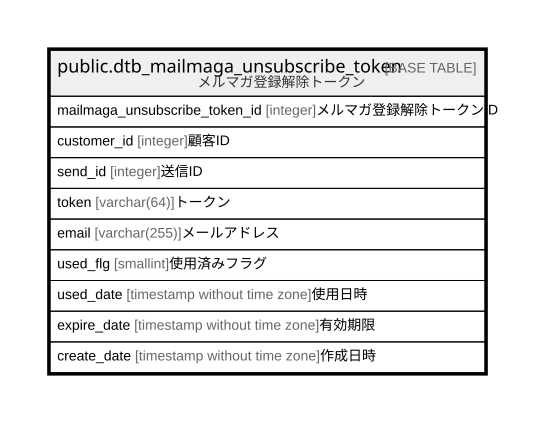

# public.dtb_mailmaga_unsubscribe_token

## Description

メルマガ登録解除トークン

## Columns

| Name | Type | Default | Nullable | Children | Parents | Comment |
| ---- | ---- | ------- | -------- | -------- | ------- | ------- |
| mailmaga_unsubscribe_token_id | integer | nextval('dtb_mailmaga_unsubscribe_token_mailmaga_unsubscribe_token_id_se'::regclass) | false |  |  | メルマガ登録解除トークンID |
| customer_id | integer |  | false |  |  | 顧客ID |
| send_id | integer |  | false |  |  | 送信ID |
| token | varchar(64) |  | false |  |  | トークン |
| email | varchar(255) |  | false |  |  | メールアドレス |
| used_flg | smallint | 0 | false |  |  | 使用済みフラグ |
| used_date | timestamp without time zone |  | true |  |  | 使用日時 |
| expire_date | timestamp without time zone |  | false |  |  | 有効期限 |
| create_date | timestamp without time zone | CURRENT_TIMESTAMP | false |  |  | 作成日時 |

## Constraints

| Name | Type | Definition |
| ---- | ---- | ---------- |
| dtb_mailmaga_unsubscribe_to_mailmaga_unsubscribe_token_not_null | n | NOT NULL mailmaga_unsubscribe_token_id |
| dtb_mailmaga_unsubscribe_token_create_date_not_null | n | NOT NULL create_date |
| dtb_mailmaga_unsubscribe_token_customer_id_not_null | n | NOT NULL customer_id |
| dtb_mailmaga_unsubscribe_token_email_not_null | n | NOT NULL email |
| dtb_mailmaga_unsubscribe_token_expire_date_not_null | n | NOT NULL expire_date |
| dtb_mailmaga_unsubscribe_token_send_id_not_null | n | NOT NULL send_id |
| dtb_mailmaga_unsubscribe_token_token_not_null | n | NOT NULL token |
| dtb_mailmaga_unsubscribe_token_used_flg_not_null | n | NOT NULL used_flg |
| dtb_mailmaga_unsubscribe_token_pkey | PRIMARY KEY | PRIMARY KEY (mailmaga_unsubscribe_token_id) |

## Indexes

| Name | Definition |
| ---- | ---------- |
| dtb_mailmaga_unsubscribe_token_pkey | CREATE UNIQUE INDEX dtb_mailmaga_unsubscribe_token_pkey ON public.dtb_mailmaga_unsubscribe_token USING btree (mailmaga_unsubscribe_token_id) |
| uniq_dtb_mailmaga_unsubscribe_token_token | CREATE UNIQUE INDEX uniq_dtb_mailmaga_unsubscribe_token_token ON public.dtb_mailmaga_unsubscribe_token USING btree (token) |
| idx_dtb_mailmaga_unsubscribe_token_customer_id | CREATE INDEX idx_dtb_mailmaga_unsubscribe_token_customer_id ON public.dtb_mailmaga_unsubscribe_token USING btree (customer_id) |
| idx_dtb_mailmaga_unsubscribe_token_send_id | CREATE INDEX idx_dtb_mailmaga_unsubscribe_token_send_id ON public.dtb_mailmaga_unsubscribe_token USING btree (send_id) |
| idx_dtb_mailmaga_unsubscribe_token_expire_date | CREATE INDEX idx_dtb_mailmaga_unsubscribe_token_expire_date ON public.dtb_mailmaga_unsubscribe_token USING btree (expire_date) |

## Relations

---

> Generated by [tbls](https://github.com/k1LoW/tbls)
