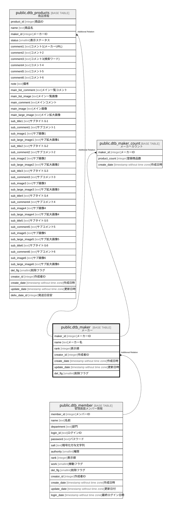

# public.dtb_maker

## Description

メーカー

## Columns

| Name | Type | Default | Nullable | Children | Parents | Comment |
| ---- | ---- | ------- | -------- | -------- | ------- | ------- |
| maker_id | integer |  | false | [public.dtb_products](public.dtb_products.md) [public.dtb_maker_count](public.dtb_maker_count.md) |  | メーカーID |
| name | text |  | false |  |  | メーカー名 |
| rank | integer | 0 | false |  |  | 表示順 |
| creator_id | integer |  | false |  | [public.dtb_member](public.dtb_member.md) | 作成者ID |
| create_date | timestamp without time zone | CURRENT_TIMESTAMP | false |  |  | 作成日時 |
| update_date | timestamp without time zone |  | false |  |  | 更新日時 |
| del_flg | smallint | 0 | false |  |  | 削除フラグ |

## Constraints

| Name | Type | Definition |
| ---- | ---- | ---------- |
| dtb_maker_create_date_not_null | n | NOT NULL create_date |
| dtb_maker_creator_id_not_null | n | NOT NULL creator_id |
| dtb_maker_del_flg_not_null | n | NOT NULL del_flg |
| dtb_maker_maker_id_not_null | n | NOT NULL maker_id |
| dtb_maker_name_not_null | n | NOT NULL name |
| dtb_maker_rank_not_null | n | NOT NULL rank |
| dtb_maker_update_date_not_null | n | NOT NULL update_date |
| dtb_maker_pkey | PRIMARY KEY | PRIMARY KEY (maker_id) |

## Indexes

| Name | Definition |
| ---- | ---------- |
| dtb_maker_pkey | CREATE UNIQUE INDEX dtb_maker_pkey ON public.dtb_maker USING btree (maker_id) |

## Relations

---

> Generated by [tbls](https://github.com/k1LoW/tbls)
