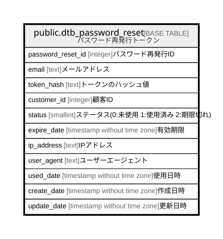

# public.dtb_password_reset

## Description

パスワード再発行トークン

## Columns

| Name | Type | Default | Nullable | Children | Parents | Comment |
| ---- | ---- | ------- | -------- | -------- | ------- | ------- |
| password_reset_id | integer | nextval('dtb_password_reset_password_reset_id_seq'::regclass) | false |  |  | パスワード再発行ID |
| email | text |  | false |  |  | メールアドレス |
| token_hash | text |  | false |  |  | トークンのハッシュ値 |
| customer_id | integer |  | true |  |  | 顧客ID |
| status | smallint | 0 | false |  |  | ステータス(0:未使用 1:使用済み 2:期限切れ) |
| expire_date | timestamp without time zone |  | false |  |  | 有効期限 |
| ip_address | text |  | true |  |  | IPアドレス |
| user_agent | text |  | true |  |  | ユーザーエージェント |
| used_date | timestamp without time zone |  | true |  |  | 使用日時 |
| create_date | timestamp without time zone | CURRENT_TIMESTAMP | false |  |  | 作成日時 |
| update_date | timestamp without time zone | CURRENT_TIMESTAMP | false |  |  | 更新日時 |

## Constraints

| Name | Type | Definition |
| ---- | ---- | ---------- |
| dtb_password_reset_create_date_not_null | n | NOT NULL create_date |
| dtb_password_reset_email_not_null | n | NOT NULL email |
| dtb_password_reset_expire_date_not_null | n | NOT NULL expire_date |
| dtb_password_reset_password_reset_id_not_null | n | NOT NULL password_reset_id |
| dtb_password_reset_status_not_null | n | NOT NULL status |
| dtb_password_reset_token_hash_not_null | n | NOT NULL token_hash |
| dtb_password_reset_update_date_not_null | n | NOT NULL update_date |
| dtb_password_reset_pkey | PRIMARY KEY | PRIMARY KEY (password_reset_id) |

## Indexes

| Name | Definition |
| ---- | ---------- |
| dtb_password_reset_pkey | CREATE UNIQUE INDEX dtb_password_reset_pkey ON public.dtb_password_reset USING btree (password_reset_id) |
| idx_dtb_password_reset_token_hash | CREATE INDEX idx_dtb_password_reset_token_hash ON public.dtb_password_reset USING btree (token_hash) |
| idx_dtb_password_reset_email_create_date | CREATE INDEX idx_dtb_password_reset_email_create_date ON public.dtb_password_reset USING btree (email, create_date) |
| idx_dtb_password_reset_expire_date_status | CREATE INDEX idx_dtb_password_reset_expire_date_status ON public.dtb_password_reset USING btree (expire_date, status) |

## Relations

---

> Generated by [tbls](https://github.com/k1LoW/tbls)
