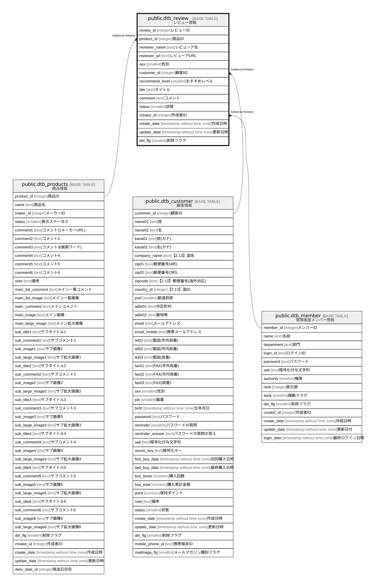

# public.dtb_review

## Description

レビュー情報

## Columns

| Name | Type | Default | Nullable | Children | Parents | Comment |
| ---- | ---- | ------- | -------- | -------- | ------- | ------- |
| review_id | integer |  | false |  |  | レビューID |
| product_id | integer |  | false |  | [public.dtb_products](public.dtb_products.md) | 商品ID |
| reviewer_name | text |  | false |  |  | レビューア名 |
| reviewer_url | text |  | true |  |  | レビューアURL |
| sex | smallint |  | true |  |  | 性別 |
| customer_id | integer |  | true |  | [public.dtb_customer](public.dtb_customer.md) | 顧客lID |
| recommend_level | smallint |  | false |  |  | おすすめレベル |
| title | text |  | false |  |  | タイトル |
| comment | text |  | false |  |  | コメント |
| status | smallint | 2 | true |  |  | 状態 |
| creator_id | integer |  | false |  | [public.dtb_member](public.dtb_member.md) | 作成者ID |
| create_date | timestamp without time zone | CURRENT_TIMESTAMP | false |  |  | 作成日時 |
| update_date | timestamp without time zone |  | false |  |  | 更新日時 |
| del_flg | smallint | 0 | false |  |  | 削除フラグ |

## Constraints

| Name | Type | Definition |
| ---- | ---- | ---------- |
| dtb_review_comment_not_null | n | NOT NULL comment |
| dtb_review_create_date_not_null | n | NOT NULL create_date |
| dtb_review_creator_id_not_null | n | NOT NULL creator_id |
| dtb_review_del_flg_not_null | n | NOT NULL del_flg |
| dtb_review_product_id_not_null | n | NOT NULL product_id |
| dtb_review_recommend_level_not_null | n | NOT NULL recommend_level |
| dtb_review_review_id_not_null | n | NOT NULL review_id |
| dtb_review_reviewer_name_not_null | n | NOT NULL reviewer_name |
| dtb_review_title_not_null | n | NOT NULL title |
| dtb_review_update_date_not_null | n | NOT NULL update_date |
| dtb_review_pkey | PRIMARY KEY | PRIMARY KEY (review_id) |

## Indexes

| Name | Definition |
| ---- | ---------- |
| dtb_review_pkey | CREATE UNIQUE INDEX dtb_review_pkey ON public.dtb_review USING btree (review_id) |

## Relations

---

> Generated by [tbls](https://github.com/k1LoW/tbls)
